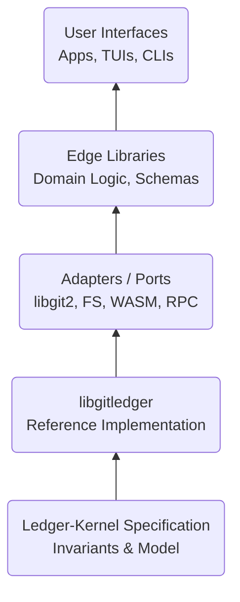

# Ledger-Kernel

***Git-native, cryptographically verifiable, append-only ledgers with policy enforcement.***

<p align="center">
  
</p>

> "What if Git's content-addressed DAG could be constrained into a deterministic state machine with cryptographic proofs for every transition?"

## What Is This?

**Ledger-Kernel** is a formal specification and reference implementation ([`libgitledger`](https://github.com/flyingrobots/libgitledger)) for building verifiable, append-only ledgers directly on top of Git's object model.

Unlike traditional blockchain or distributed ledger systems, Ledger-Kernel:

✅ Is just Git! No custom storage, no daemons, just `.git`.
✅ Enforces fast-forward-only semantics. History is immutable by design.
✅ Provides deterministic replay. Same entries = same state, always.
✅ Cryptographically attests every entry. Non-repudiable authorship.
✅ Supports programmable policies. WASM-based rules for entry validation.

## Why Would You Use This?

### The Problem

You need tamper-evident provenance for:

- Software supply chain attestations (SLSA, Sigstore, in-toto)
- Deployment histories (who deployed what, when, and why)
- Configuration changes (immutable audit logs)
- Registry systems (package versions, schema migrations)

But you don't want to:

- Run a blockchain node
- Trust a centralized SaaS
- Invent yet another storage format

## The Solution

**Ledger-Kernel** gives you blockchain-like guarantees using Git as the database.

```bash
# Append a deployment record
git ledger append --ref refs/_ledger/prod/deploys - 
  --payload '{"service":"api","version":"v1.2.3","who":"alice"}'

# Replay the ledger to verify state
git ledger replay --ref refs/_ledger/prod/deploys

# Verify all invariants (signatures, policies, timestamps)
git ledger verify --ref refs/_ledger/prod/deploys
```

## What You Get

So, what can you do with an append-only ledger with cryptographically signed provenance? It's up to you! Ledger-Kernel and `libgitledger` aren't workflows, they give you a new type of primitive. Before you had git commits, which tracked versions of your code. Now you have git ledger entries, and how you use them is up to you! This technology is simple, almost invisible. Boring, in the best way. But useful when it needs to be.

## Architecture at a Glance



### Layers

Data flows unidirectionally. Components have been cleanly separated by domain. Ex: A user wants to add an Entry to the Ledger. (i) They issue a command (ii) the application's business layer handles it (iii) requesting a git commit from the git service (iv) which then creates the git commit and pushes only the specific ledger-namespaced refs it updated using `--no-verify` to avoid triggering git hooks.

- Kernel Spec — Formal model, invariants, compliance tests
- `libgitledger` — Portable C implementation with FFI bindings
- Adapters — Git (`libgit2`), WASM policy VM, RPC daemon
- UIs — CLIs, TUIs, web dashboards
- Edges — Domain-specific tools ([Shiplog](https://github.com/flyingrobots/shiplog), [Wesley](https://github.com/flyingrobots/Wesley), [Git-Mind](http://github.com/neuroglyph/git-mind))

## Core Invariants

Every compliant implementation **MUST** enforce:

| Invariant | Meaning |
|---|---|
| Append-Only | Entries cannot be modified or deleted |
| Fast-Forward Only | No rebases, no force pushes |
| Deterministic Replay | Identical inputs → identical state |
| Authenticated Entries | All entries are cryptographically signed |
| Policy Enforcement | Programmable rules gate entry acceptance |
| Temporal Monotonicity | Timestamps never regress |
| Namespace Isolation | Ledgers are independent |

## Quick Start

1. Install `libgitledger`

```bash
git clone https://github.com/flyingrobots/ledger-kernel
cd ledger-kernel
make && sudo make install
```

2. Initialize a Ledger

```bash
git init my-ledger
cd my-ledger
git ledger init --namespace prod/deploys
```

3. Append an Entry

```bash
git ledger append - 
  --ref refs/_ledger/prod/deploys - 
  --payload '{"msg":"Deployed api@v1.0.0"}' - 
  --sign-with ~/.ssh/id_ed25519
```

4. Replay & Verify

```bash
# Deterministically reconstruct state
git ledger replay --ref refs/_ledger/prod/deploys

# Verify all cryptographic proofs
git ledger verify --ref refs/_ledger/prod/deploys
```

## Documentation

| Document | Purpose |
|---|---|
| SPEC.md | Formal specification and invariants |
| MODEL.md | Mathematical state-transition model |
| ARCHITECTURE.md | System design and layer responsibilities |
| IMPLEMENTATION.md | libgitledger implementation details |
| REFERENCE.md | Language-neutral API contract |
| COMPLIANCE.md | Test suite and conformance criteria |

## Edge Systems (Art Built on Ledger-Kernel)

### 🚢 Shiplog

> *Deployment provenance without SaaS*

```bash
git shiplog run -- "kubectl apply -f deploy.yaml"
```

- Captures `$PWD`, `$USER`, `$HOSTNAME`, `exit` code
- Signs with SSH key
- Appends to ledger in `.git`
- Zero external dependencies

### 🧠 Git-Mind

> *Knowledge graphs in Git*

```bash
git mind ingest notes/
git mind query "show me all TODO items"
```

- RDF triples stored as ledger entries
- Deterministic graph replay
- SPARQL-like queries

## Security Model

| **Principle** | **Implementation** |
|-----------|----------------|
| Traceability | Every entry is cryptographically signed |
| Non-Repudiation | Compliance proofs are emitted per operation |
| Monotonic Atomicity | Ledger refs only fast-forward |
| Programmable Authorization | WASM policies enforce custom rules |
| Offline Verifiability | Anyone with read-access can replay history |

## Compliance & Testing

```bash
# Run the full compliance suite
make compliance

# Check determinism across environments
make determinism

# Generate proof artifacts
make proofs
```

## Compliance Levels:

- **Core** - Pass 8 mandatory invariant tests
- **Extended** - Multi-sig, policy composition, replay-under-failure
- **Certified** - Reproducible proofs + determinism audit
- **Verified** - Independently reviewed + signed compliance report

## Language Bindings

| Language | Status | Location |
|----------|--------|----------|
| C | 🚧 *Reference* | `libgitledger` |
| Rust | 🚧 | In Progress |
| bindings/Go | 🚧 | Planned |
| bindings/go/JS/WASM | 🚧 | Planned |
| bindings/js/Python | 🚧 | Planned |

## Contributing

<!-- We welcome contributions! Please see CONTRIBUTING.md for: -->

_Coming Soon_

<!-- Code style guidelines
How to run tests
Submitting PRs
Reporting issues -->

---

## License

MIT - With Ethical Promise. © J. Kirby Ross
See [LICENSE](./LICENSE) for details.

---

## Project Status

Current Version: 0.1.0 (Draft Specification)
Roadmap:

- [x] ✅ Specification finalized
- [ ] 🚧 `libgitledger` reference implementation (in progress)
- [ ] 🚧 Compliance test suite
- [ ] 🔜 Edge system: Shiplog uses `libgitledger` instead of `git` (MVP)
- [ ] 🔜 WASM policy engine integration

---

## Acknowledgments

### **Prior Art**

- Git ([Linus Torvalds](https://github.com/torvalds)) - The content-addressed DAG
- [Certificate Transparency](https://certificate.transparency.dev/) (Google) - Append-only logs
- [Sigstore](https://www.sigstore.dev/) - Supply chain attestation
- [Nix](https://nixos.org/) - Deterministic builds

---

## Contact

**Author**: J. Kirby Ross  
**Email**: [<james@flyingrobots.dev>](mailto:james@flyingrobots.dev)   
**GitHub**: [flyingrobots](https://github.com/flyingrobots/)

> "Provenance without clutter. Policy as infrastructure. Zero SaaS, zero guesswork."
