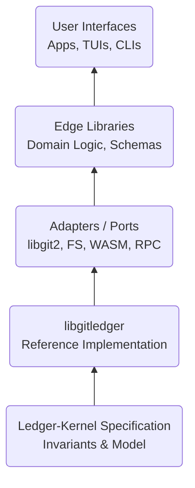

# Ledger-Kernel

[](https://flyingrobots.github.io/ledger-kernel/) [](https://flyingrobots.github.io/ledger-kernel/)

**Git-native, cryptographically verifiable, append-only ledgers with policy enforcement.**


> _“What if Git’s content-addressed DAG could be constrained into a deterministic state machine with cryptographic proofs for every transition?”_

### What Is It?

**Ledger-Kernel** is a formal specification and reference implementation ([`libgitledger`](https://github.com/flyingrobots/libgitledger)) for building verifiable, append-only ledgers directly on top of Git’s object model.

Unlike blockchains or SaaS audit logs, **Ledger-Kernel is just Git**. 
It adds deterministic replay, cryptographic attestation, and programmable policy enforcement without introducing new infrastructure.

It uses existing `.git` storage, requiring no daemons or databases. It enforces fast-forward-only semantics to ensure history is immutable and guarantees deterministic replay, where identical input always yields identical state. Every entry is attested for non-repudiable authorship, and the system supports WASM-based policies for validation.

✅ **It's _just_ Git!** No custom storage, no daemons, just `.git`.  
✅ Enforces fast-forward-only semantics. History is immutable by design.  
✅ Provides deterministic replay. Same entries = same state, always.  
✅ Cryptographically attests every entry. Non-repudiable authorship.  
✅ Supports programmable policies. WASM-based rules for entry validation.  

### Why Use It?

#### The Problem

You need tamper-evident provenance for deployments, supply-chain attestations, configuration histories, or schema registries — but you don’t want to run a blockchain node, depend on a vendor SaaS, or invent another storage format.

#### The Solution

**Ledger-Kernel** provides blockchain-grade guarantees using Git as the database.

```bash
# Append a deployment record
git ledger append --ref refs/_ledger/prod/deploys \
  --payload '{"service":"api","version":"v1.2.3","who":"alice"}'

# Replay to verify deterministic state
git ledger replay --ref refs/_ledger/prod/deploys

# Verify invariants (signatures, policies, timestamps)
git ledger verify --ref refs/_ledger/prod/deploys
```

### What You Get

**Ledger-Kernel** and [`libgitledger`](https://github.com/flyingrobots/libgitledger) introduce **a new primitive**: _ledger entries_ — Git commits with _meaning, policy, and proof_. They’re quiet, boring, and perfectly auditable. You decide how to use them.

## Architecture at a Glance



> _Data flows upward through distinct layers._

The architecture is layered. The Kernel Spec defines the formal model and invariants. [`libgitledger`](https://github.com/flyingrobots/libgitledger) implements those rules in portable C. Adapters connect to Git, WASM policy engines, and RPC daemons. Edges (like [Shiplog](https://github.com/flyingrobots/shiplog), [Wesley](https://github.com/flyingrobots/wesley), [Git-Mind](https://github.com/neuroglyph/git-mind)) apply them to real-world domains. Finally, UIs—CLIs, TUIs, and dashboards—wrap the edges for human use.

- Kernel Spec — Formal model, invariants, compliance tests
- `libgitledger` — Portable C implementation with FFI bindings
- Adapters — Git (`libgit2`), WASM policy VM, RPC daemon
- UIs — CLIs, TUIs, web dashboards
- Edges — Domain-specific tools ([Shiplog](https://github.com/flyingrobots/shiplog), [Wesley](https://github.com/flyingrobots/Wesley), [Git-Mind](http://github.com/neuroglyph/git-mind))

## Core Invariants

Every compliant implementation **MUST** enforce:
| Invariant | Meaning |
|---|---|
| Append-Only | Entries cannot be modified or deleted |
| Fast-Forward Only | No rebases, no force pushes |
| Deterministic Replay | Identical inputs → identical state |
| Authenticated Entries | All entries are cryptographically signed |
| Policy Enforcement | Programmable rules gate entry acceptance |
| Temporal Monotonicity | Timestamps never regress |
| Namespace Isolation | Ledgers are independent |

## Implementing the spec?

If you’re building your own implementation (in C, Rust, Go, …), here’s the quickest path:

1) Pin this spec as a submodule (recommended)

```bash
git submodule add -b main https://github.com/flyingrobots/ledger-kernel external/ledger-kernel
git submodule update --init --recursive
```

2) Expose a compliance mode in your CLI

```bash
your-cli verify --compliance \
  [--level core|policy|wasm] \
  [--output compliance.json] \
  [--schema external/ledger-kernel/schemas/compliance_report.schema.json]
```

3) Emit a report that validates against the schema

```
external/ledger-kernel/schemas/compliance_report.schema.json
```

4) Run it locally or in CI

```bash
your-cli verify --compliance
jq -e '.summary.core=="PASS"' compliance.json
```

Documentation
- Spec → Model / Formal Spec / Wire Format / Compliance live under `docs/spec/` (rendered at the docs site).
- How to run the harness (user‑facing): `docs/cli/harness.md`.
- Implementers Guide (repo setup, CLI contract, CI snippets): `docs/implementation/implementers.md`.

Reference implementation
- Portable C reference: https://github.com/flyingrobots/libgitledger

## Quick Start

1.  **Install libgitledger**
    ```bash
    git clone https://github.com/flyingrobots/ledger-kernel
    cd ledger-kernel && make && sudo make install
    ```

2.  **Initialize a Ledger**
    ```bash
    git init my-ledger
    cd my-ledger
    git ledger init --namespace prod/deploys
    ```

3.  **Append an Entry**
    ```bash
    git ledger append \
      --ref refs/_ledger/prod/deploys \
      --payload '{"msg":"Deployed api@v1.0.0"}' \
      --sign-with ~/.ssh/id_ed25519
    ```

4.  **Replay & Verify**
    ```bash
    git ledger replay  --ref refs/_ledger/prod/deploys
    git ledger verify  --ref refs/_ledger/prod/deploys
    ```

---

## Documentation

| Document | Purpose |
|---|---|
| SPEC.md | Formal specification and invariants |
| MODEL.md | Mathematical state-transition model |
| ARCHITECTURE.md | System design and layer responsibilities |
| IMPLEMENTATION.md | libgitledger implementation details |
| REFERENCE.md | Language-neutral API contract |
| COMPLIANCE.md | Test suite and conformance criteria |

## Edge Systems (Art Built on Ledger-Kernel)

### 🚢 [Shiplog](https://github.com/flyingrobots/shiplog)

> *Deployment provenance without SaaS*

```bash
git shiplog run -- "kubectl apply -f deploy.yaml"
```

- Captures `$PWD`, `$USER`, `$HOSTNAME`, `exit` code
- Signs with SSH key
- Appends to ledger in `.git`
- Zero external dependencies

### 🧠 [Git-Mind](https://github.com/neuroglyph/git-mind)

> *Knowledge graphs in Git*

```bash
git mind ingest notes/
git mind query "show me all TODO items"
```

- RDF triples stored as ledger entries
- Deterministic graph replay
- SPARQL-like queries

## Security Model

**Traceability**: Every entry is cryptographically signed.  
**Non-Repudiation**: Compliance proofs are emitted per operation.  
**Monotonic Atomicity**: Ledger refs advance only by fast-forward.  
**Programmable Authorization**: WASM policies act as rule gates.  
**Offline Verifiability**: Anyone with read access can replay history.  

---

### Compliance & Testing

```bash
make compliance     # run invariant tests
make determinism    # cross-platform determinism check
make proofs         # emit proof artifacts
```

Compliance levels progress from Core (eight mandatory invariants) to Verified (independent audit with signed report).

### Language Bindings Status  

- The C language is the reference implementation (✅ Reference, [libgitledger](https://github.com/flyingrobots/libgitledger)).  
- Rust is currently in progress (🚧 In progress, —).  
- Go, JS / WASM, and Python are all planned (🔜 Planned, —).  

---

## Project Status 

### v0.1.0 (Draft Specification)

The specification is finalized (✅).  
The [`libgitledger`](https://github.com/flyingrobots/libgitledger) reference implementation and the compliance test suite are both in progress (🚧).  
[Shiplog](https://github.com/flyingrobots/shiplog) integration using libgitledger and the WASM policy engine are planned for the future (🔜).  

---

## Acknowledgments

This project acknowledges 

Git ([Linus Torvalds](https://github.com/torvalds)) for the content-addressed DAG  
[Certificate Transparency](https://certificate.transparency.dev/) for append-only logs  
[Sigstore](https://www.sigstore.dev/) for supply-chain attestations  
and [Nix](https://nixos.org/) for deterministic builds.  

---

## Art Built on Ledger-Kernel Edges

### 🧮 **[`libgitledger`](https://github.com/flyingrobots/libgitledger)**


`libgitledger` is a portable, embeddable C library for append-only ledgers inside a Git repository. Each ledger is a linear history of Git commits on dedicated refs; entries are optionally signed, policy-checked, and indexed for instant queries. It enables both human-readable and binary-safe payloads via a pluggable encoder. 

**Why this exists:** I’ve built the pattern twice already. shiplog (battle-tested CLI & policy/trust) and git-mind (rigorous hexagonal architecture + roaring bitmap cache). `libgitledger` fuses them into one stable core library with bindings for Go/JS/Python.

### 🚢 [Shiplog](https://github.com/flyingrobots/shiplog) • Deployment Provenance Without SaaS


Shiplog turns your Git repo into a cryptographically-signed, append-only ledger for every deployment. Zero SaaS costs. Zero external infra. **Just Git.**

Run anything with:

```bash
git shiplog run <your-command>
```

Shiplog captures stdout, stderr, exit code, timestamp, author, and reason - the stuff you'd normally lose to the void - and logs it in a signed, immutable ref right inside Git. Who/What/Where/When/Why/How; mystery solved. Deployment logs now live with your codebase, but apart from it. Provenance without clutter.

### 🛼 [Wesley](https://github.com/flyingrobots/wesley) • The Data Layer Compiler


Stop describing your data model six times in six different files.  
Everyone else generates GraphQL from databases. Wesley flips the stack and generates databases from GraphQL.

From one schema, Wesley compiles your entire backend:

- Postgres DDL & migrations
- TypeScript types & Zod validators
- Supabase RLS, Realtime & Storage rules
- tRPC endpoints & Prisma/Drizzle integration
- pgTAP tests
- A SHA-locked "Shipme" certification file for zero-downtime deployments

Your schema is the source of truth. Everything else is a compilation target.  
Banish drift. Never think about migrations again. Describe your shapes once and let Wesley handle the rest.

_Go on, deploy on a Friday._

### 🧠 [Git-Mind](https://github.com/neuroglyph/git-mind) • Knowledge Graphs in Git


```bash
git mind ingest notes/
git mind query "show me all TODO items"
```
> _Version your thoughts. Branch your ideas. Merge understanding._

`git-mind` is an open-source protocol and toolkit that turns Git into a database-less, version-controlled semantic knowledge graph — a tool for distributed cognition, evolving interpretation, and human–AI co-thought.

---

## Contact

**Author**: _J. Kirby Ross_  
**Email**: [james@flyingrobots.dev](mailto:james@flyingrobots.dev)  
**GitHub**: [flyingrobots](https://github.com/flyingrobots)  

---

## License

MIT License (_with Ethical Use Clause_) · **© 2025 J. Kirby Ross**  
_See [`LICENSE`](./LICENSE) and [`NOTICE`](./NOTICE.md) for terms._

> _“Provenance without clutter. Policy as infrastructure. Zero SaaS, zero guesswork.”_
