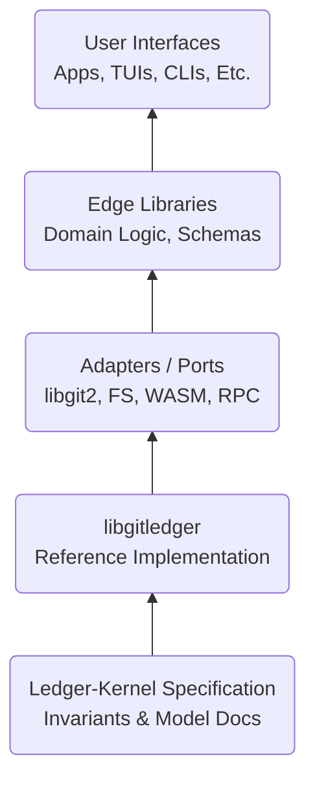
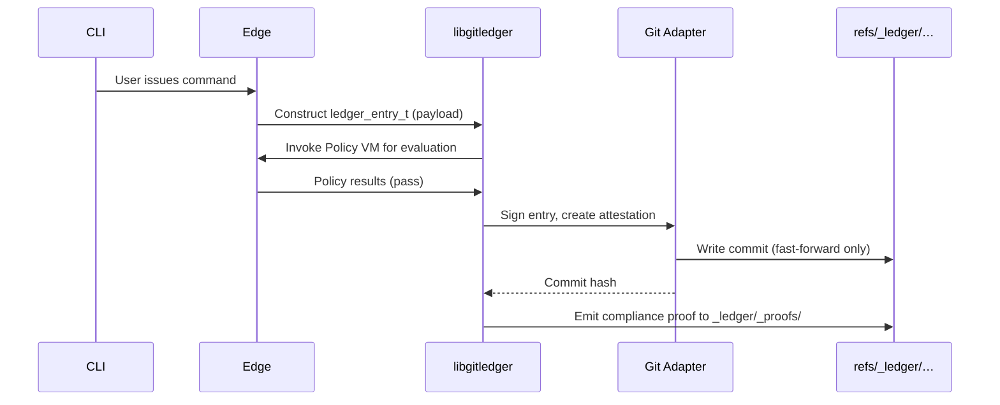
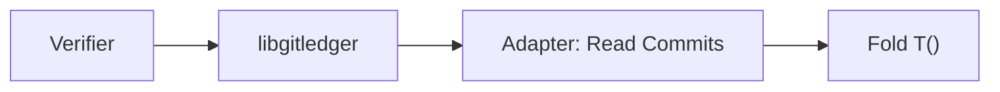
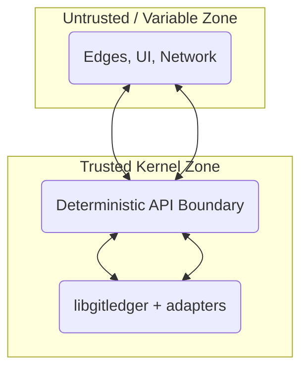
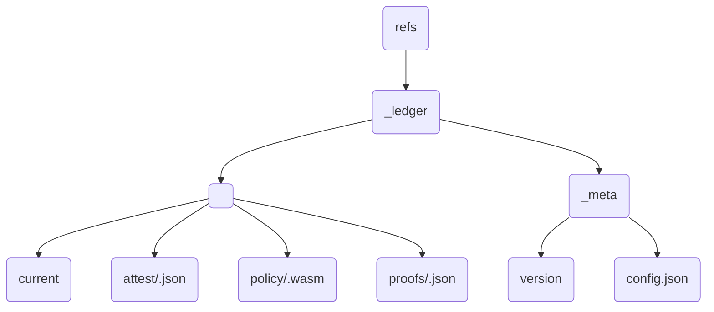
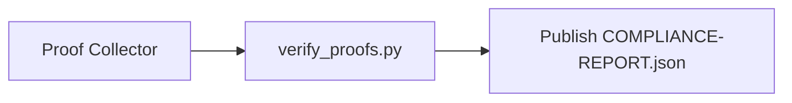
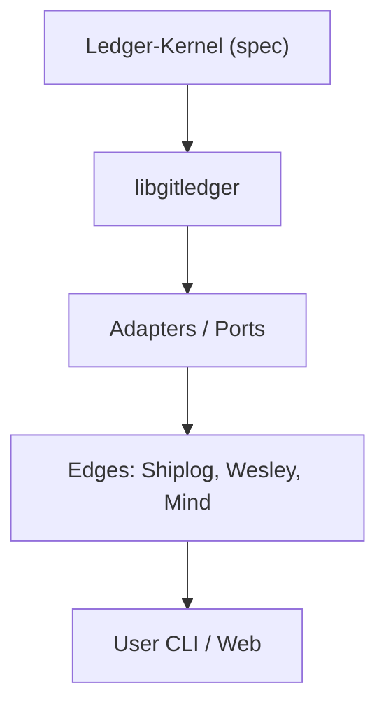

# **Ledger-Kernel System Architecture**

## 1.0 Overview

The **Ledger-Kernel** architecture is defined as a modular, layered stack built upon the foundation of the Git object model. It provides a deterministic, cryptographically-verified substrate for managing append-only state.

This architecture enforces a strict, unidirectional dependency model. Upper layers may depend on the interfaces exposed by lower layers, but lower layers possess no knowledge of, and do not depend upon, the layers above them. This ensures a clean separation of concerns, from the abstract mathematical model at the core to the domain-specific user interfaces at the periphery.

The stack is composed as follows:



> *Data flows unidirectionally between layers, bottom-to-top.*

---

## 2.0 Layer Responsibilities

Each layer in the stack has a distinct and well-defined set of responsibilities.

### 2.1 Ledger-Kernel (Specification + Model)

This foundational layer defines the axiomatic properties of the system. Here, we define the abstract rules that must always be true for a ledger to be considered valid. Its responsibilities include defining the **semantic and mathematical invariants** (see [`SPEC.md`](./SPEC.md), and [`MODEL.md`](./MODEL.md)), specifying the canonical reference layout and data schemas, and provide the compliance suite and defining all proof obligations for implementations.

### 2.2 `libgitledger` (Core Runtime)

This layer is the core runtime, a concrete and portable C implementation of the abstract specification. It implements the logic for Git object creation, reference management, and invariant validation.

Its role is to expose the canonical, language-neutral Reference API (see [`REFERENCE.md`](./REFERENCE.md)).

> [!tip] What if AI could generate and emit compliance proofs for every mutating operation?

### 2.3 Adapters / Ports

Adapters are thin, pluggable components that translate between the core domain/Reference API and external systems (e.g., Git via libgit2, filesystem stubs, a WASM policy VM, an RPC daemon, or a crash journal). They are responsible for protocol/I-O translation, durability boundaries, optional policy runtime embedding, and providing test doubles. Adapters implement the canonical port contracts defined by the Reference API so the core remains implementation‑agnostic and the kernel’s semantics do not depend on any specific integration technology.

| **Adapter** | **Role** |
|---|---|
| **Git** | Uses `libgit2` to manipulate Git objects and references. |
| **FS** | Provides a lightweight file-system stub for testing and simulation. |
| **WASM Policy VM** | Implements a deterministic policy evaluation engine. |
| **RPC Daemon** | Functions as a gRPC/HTTP bridge for remote clients. |
| **Crash Journal** | Offers a buffered write-ahead log for enhanced durability. |

Each adapter must implement the same port interface, defined conceptually as:

```c
int port_apply(ledger_ctx_t*, ledger_entry_t*);
int port_fetch(ledger_ctx_t*, ledger_state_t*);
```

### 2.4 Edges (Domain Systems)

Edge systems are domain-specific applications that apply the Ledger-Kernel's capabilities to solve real-world problems. They encapsulate the business logic and schemas for a particular workflow.

| **Edge** | **Domain** |**Example Invocation** |
|---|---|---|
| **Shiplog** | Ops / Deployments | `shiplog run <cmd>` |
| **Wesley** | Schema Management | `wesley plan` / `wesley apply` |
| **Git-Mind** | Knowledge Graph | `git-mind ingest` |

> All edge systems execute their domain logic by composing calls to `libgitledger` for core operations such as `append`, `attest`, and `replay`.

### 2.5 User Interfaces

This outermost layer consists of user-facing tools, dashboards, and automation scripts that wrap the functionality provided by the Edge systems. These interfaces are explicitly defined as existing *outside* the trusted kernel boundary.

---

### 2.6 Infrastructure Services (Projects: Star Gate & Magic Mirror)

These subsystems operate above the deterministic kernel but beneath the domain-specific edges.

#### Star Gate (Replication Layer)

**Star Gate** functions as a distributed transport layer responsible for synchronizing ledgers across disparate remotes. It achieves this by providing asynchronous replication of the _ledger/ references, utilizing signed journal queues for integrity. Furthermore, Star Gate implements consistency watermarks to guarantee *read-after-write* safety across different sites and offers optional encryption and access control mechanisms suitable for multi-tenant deployments.

#### Magic Mirror (Observability Layer)

**Magic Mirror** is a deterministic reflection service designed to expose ledger state and cryptographic proofs to external systems. It enables the creation of real-time dashboards and query APIs that are demonstrably backed by verified proofs. The service also supports periodic snapshotting of the ledger state to facilitate offline verification and provides robust event streaming capabilities to broadcast policy violations or other critical audit triggers.

Both services consume the same compliance proofs emitted by `libgitledger` and operate strictly in a *read-replicate-verify* mode; they can never mutate canonical ledger history.

---

## 3.0 Execution Flow

The architecture defines clear, sequential flows for its primary operations.

You can turn that into a proper sequence diagram by switching Mermaid from graph LR to sequenceDiagram.
Here’s the corrected block:

### 3.1 Append Operation

A new entry is appended to the ledger via the following sequence:



> *A user’s command as it flows from CLI to ledger Entry.*

The process unfolds as follows:

1. The Edge system (e.g., Shiplog) constructs a `ledger_entry_t` object containing the domain-specific payload.
2. The Policy VM adapter is invoked to evaluate all attached policies against the candidate entry.
3. If policies pass, `libgitledger` signs the entry, creating a valid attestation.
4. The Git Adapter writes the entry as a new commit, enforcing the fast-forward-only invariant on the target ref.
5. Finally, `libgitledger` emits a compliance proof to the `_ledger/_proofs/` directory.


### 3.2 Replay Operation

A ledger's state is deterministically reconstructed for verification via this flow:



This process, which applies the deterministic transition function $T()$ over the complete entry list, culminates in a final state digest that can be used for auditing and verification.

---

## 4.0 Trust Boundary

A critical architectural concept is the **Trust Boundary**, which separates the deterministic kernel from the non-deterministic applications that consume it.



- **Trusted Kernel Zone:** Any component *inside* this zone, including `libgitledger` and its adapters, must be fully reproducible, deterministic, and attestable.
- **Untrusted / Variable Zone:** Components *outside* this zone, such as UIs and network-facing services, are permitted to be nondeterministic but are programmatically prevented from altering ledger history in any way that violates the kernel's invariants.

---

## 5.0 Ref Layout (Normative)

The following Git reference layout is normative, meaning all compliant implementations must adhere to this structure.



---

## 6.0 Proof and Audit Pipeline

The architecture mandates that every mutating operation emits a corresponding proof object. A separate, asynchronous auditor process can then validate these proofs to ensure ongoing compliance.



> Audit artifacts, such as the `COMPLIANCE-REPORT.json`, are themselves frequently stored as ledgers. This enables a recursive "ledger-of-ledgers" verification model, where the history of compliance itself is immutable and verifiable.

---

## 7.0 Extensibility Pattern

Extensibility is managed through a declarative manifest system. Adapters and Edge systems register their components via a manifest file.

```json
{
  "name": "shiplog",
  "adapter": "git",
  "policies": ["require_sig", "no_rebase"],
  "schema_version": "0.1.0"
}
```

This pattern provides a clear and robust path for future extensions, including:

> [!tip] What if there were pluggable storage backends (e.g., object databases, CRDT stores)?

> [!tip] What if the ledger could be federated, for multi-remote reconciliation?

> [!tip] What if there were read-optimized caches, such as an index of ledger_state_digests?

---

## 8.0 Security Model

The system's security is derived from a composite model of five key principles:

> [!important] **8.1 Traceability and Non-Repudiation**  
> Every state change is cryptographically signed and directly traceable to its author. The resulting compliance proofs serve as non-repudiation evidence.

> [!important] **8.2 Monotonic Atomicity**  
> Ledger reference updates are guaranteed to be both monotonic (fast-forward-only) and atomic (all-or-nothing).

> [!important] **8.3 Programmatic Authorization**   
> Policies function as a programmable authorization layer. Algorithmic enforcement of custom business rules before an entry can be appended.

> [!important] **8.4 Offline Verifiability**  
> The entire history of a ledger can be replayed and verified offline by any party with read-access to the repository, without reliance on a central trusted server. Thanks Git!

---

## 9.0 Dependency Graph (Summary)

The following diagram summarizes the complete, one-way dependency graph of the architecture, from the abstract specification to the concrete user-facing tools.



---

## 10.0 Design Principles

The architecture is governed by five core design principles, which are summarized below.

| **Principle** | **Meaning** |
|---|---|
| **Determinism First** | Identical inputs must always produce identical outputs. |
| **No Hidden State** | All canonical state data lives within the Git repository. |
| **Append > Mutate** | *No in-place edits are permitted*; history is built only from new entries. |
| **Proof-Driven** | Every significant action must yield verifiable evidence of its execution. |
| **Composability** | Layers are designed as replaceable modules with stable interfaces. |

---

## 11.0 Implementation Notes

The following technical notes are prescriptive for any compliant implementation. 

The recommended reference build consists of the canonical C library statically linked with `libgit2` (version 1.7 or higher). Furthermore, it is a normative requirement that all persistent references under the `_ledger/` namespace are configured to be fast-forward-only on the Git remote. 

BLAKE3 is the specified algorithm for all canonical hashing. 

Finally, to ensure determinism, implementations must avoid environment-dependent timestamps, adopting a pattern such as `SOURCE_DATE_EPOCH` for reproducible builds and entries.

## 12.0 Future Considerations

This section outlines potential, non-binding directions for future development that build upon the current architectural model. 

Imagine: A ledger replication service (see §2.6) to provide highly available, read-optimized copies of ledger state

What about a CRDT-based multi-writer reconciliation to allow for decentralized, parallel appends from multiple authors?

Or zero-knowledge proof extensions to enable the creation of private or partially-private ledgers; 

Could try multi-subtree federation, which would allow organizations to manage federated ledgers under a shared `refs/_ledger/<org>/<project>/` namespace.
