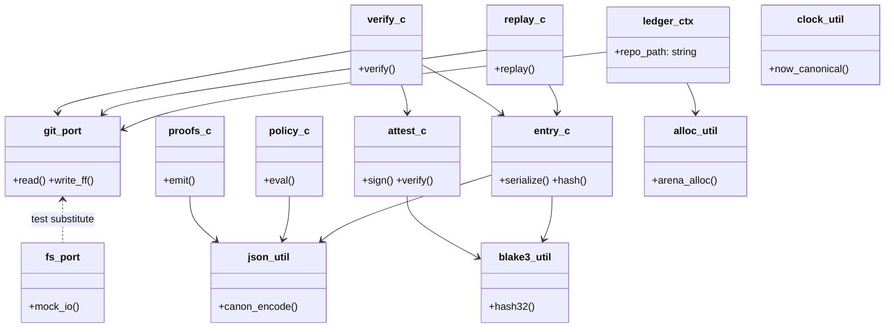
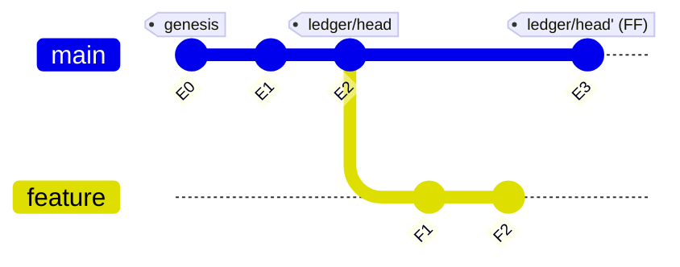
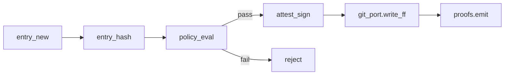
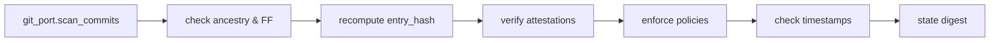
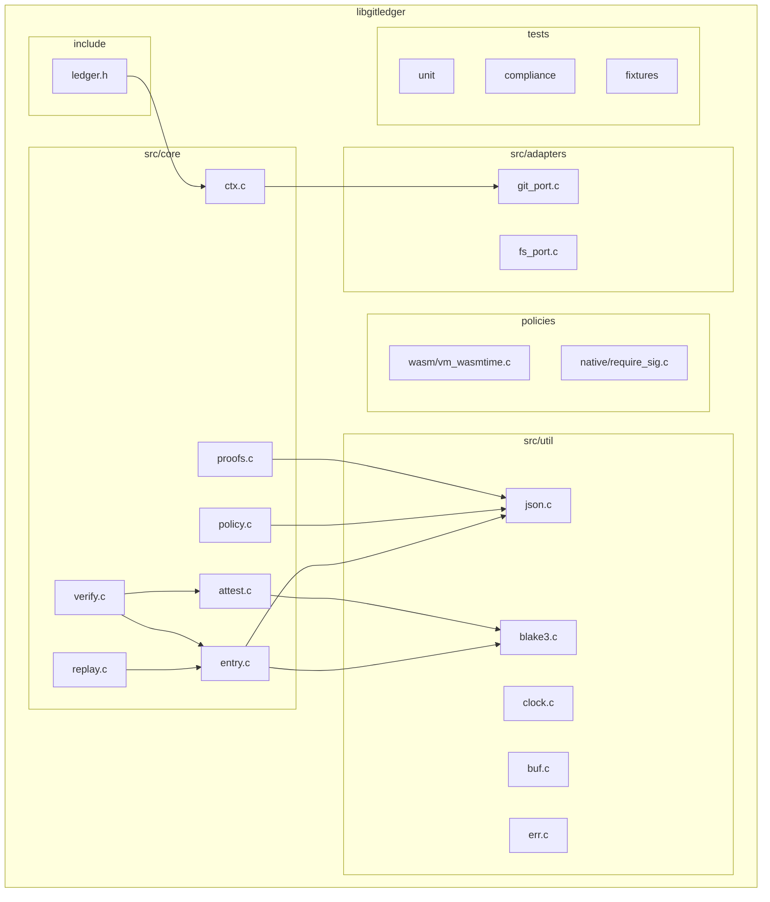

# `libgitledger`: A Git‑Native Reference Implementation of a Deterministic, Verifiable Ledger

##Abstract

This paper presents `libgitledger`, a portable C reference implementation of a verifiable, append‑only ledger that operates natively within a standard Git repository. The library instantiates the formal model described in [`MODEL.md`](./MODEL.md) and adheres to the invariants set forth in [`SPEC.md`](./SPEC.md) by constraining a designated Git reference to fast‑forward only evolution, serializing entries using a canonical JSON encoding, and binding those entries to cryptographic attestations.

Policy compliance is enforced through a deterministic evaluation interface that admits both native predicates and an optional, fuel‑metered WebAssembly policy engine.

The implementation is organized as a small set of orthogonal modules layered over `libgit2`, with strict controls for determinism, time, memory management, and error classification.

We describe the system architecture, data paths for append, replay, and verify operations, and the proof artifacts that enable external auditability. We further report on compliance tests and reproducibility checks that collectively validate the implementation’s conformance to the kernel specification.

---

## 1. Introduction

Git’s content‑addressed object model, together with its global reference namespace, furnishes a robust foundation for provenance. Yet, its affordances for branching and history rewriting introduce ambiguity for applications that require a totally ordered, non‑repudiable history. `libgitledger` reconciles this tension by erecting a deterministic state machine on top of a constrained Git reference whose history evolves exclusively via fast‑forward commits. Each commit encodes a single ledger entry, and the entire sequence forms a pure, replayable computation whose output state is uniquely determined by the ordered set of entries. This paper explains how the implementation realizes that model and exposes a minimal, language‑agnostic API compatible with [`REFERENCE.md`](./REFERENCE.md).

The overarching design thesis is that **a ledger should be a conservative extension of infrastructure developers already trust**. By forming the kernel using Git, a well-trusted, battle-worn powerhouse, without introducing bespoke storage or a privileged daemon, `libgitledger` inherits well‑understood operational semantics while adding determinism, cryptographic attestation, and verifiable policy enforcement. The result is a compact, auditable implementation that can be linked into a wide range of host systems.

---

## 2. Design Objectives and Non‑Objectives

The primary objective is to deliver a deterministic, portable C library that enforces the kernel invariants precisely as specified. Determinism is ensured by canonical serialization, a stable hashing scheme, and a replay mechanism that is both pure and free of ambient I/O effects. Git nativity is achieved by using `libgit2` to create and traverse a fast‑forward‑only commit chain under a dedicated reference; the library neither wraps a network service nor introduces an auxiliary storage layer. Extensibility is realized by abstracting allocators and hashers, and by offering a policy interface that supports both native predicates and a sandboxed WebAssembly engine for user‑defined constraints. Finally, **every mutating operation emits a proof artifact to substantiate its effect and facilitate external auditing**.

Several non‑objectives sharpen this scope. The implementation does not embed a network stack or long‑running daemon, which are considered orthogonal concerns best addressed by higher‑level services. The library does not encode domain‑specific business logic; applications such as supply‑chain attestations or registries link against `libgitledger` and implement their own schemas and transition functions consistent with the kernel model.

---

## 3. System Overview

`libgitledger` organizes its implementation into a small set of cooperating modules. The context layer provides repository access, configuration, and handles to pluggable subsystems. Core modules implement entry serialization and hashing, attestation creation and verification, policy evaluation, deterministic replay, invariant checking, and proof emission. Adapter modules isolate environmental dependencies, most notably Git operations via `libgit2` and, for tests, a minimal filesystem stub that permits property‑based testing without a full Git object store. Utility modules house canonical JSON encoding, BLAKE3 hashing, clock normalization, memory arenas, and error taxonomy.

The following diagram summarizes the static structure of the implementation and the primary dependencies among modules.



---

## 4. Data Representation and Canonicalization

Each ledger entry is represented as a canonical JSON document whose key ordering, numeric formats, and string encodings are stable across platforms. The canonical serializer rejects NaN and Infinity, normalizes text to UTF‑8, and enforces 64‑bit integer bounds. The base hash of an entry is computed as BLAKE3 over the canonical serialization of the entry excluding the attestation list; attestations reference this base hash and are stored adjacently. This separation permits multiple attestations and quorum logic without perturbing the entry’s identity.

The library’s time handling is deliberately deterministic. When the environment variable `SOURCE_DATE_EPOCH` is set, timestamps are derived from it; otherwise, they are read from the system clock and normalized to UTC in `RFC 3339` format. Temporal monotonicity is validated during verification and enforced during append by comparing a candidate entry’s timestamp with its parent’s timestamp in the fast‑forward chain.

---

## 5. Git‑Native Storage and Fast‑Forward Semantics

All persistent state is stored in the Git object database of the host repository. Appends materialize a tree and commit object whose parent is the current head of the ledger reference. The reference is advanced atomically using `libgit2` only if the new commit is a descendant of the current head, thereby precluding history rewrites. The prohibition on merges is structural: the ledger reference names a single lineage, and verification fails if a non‑linear ancestry is encountered. The diagram below illustrates the fast‑forward constraint and the non‑participation of incidental branches in the ledger’s evolution.



In this depiction, only the path `E0→E1→E2→E3` constitutes the ledger history. The feature branch is extraneous to verification and cannot be merged into the ledger reference. The reference advances from E2 to E3 by a fast‑forward update.

---

## 6. Operational Pipelines

The implementation centers on three pipelines: append, replay, and verify. Each pipeline is structured as a pure or near‑pure computation where impurity is limited to repository reads or, for append, a single guarded reference update.

The append pipeline begins with entry construction, proceeds through canonical hashing and policy evaluation, binds one or more attestations to the entry hash, writes a new commit as a fast‑forward descendant of the ledger head, and emits a proof artifact summarizing the operation.



Replay is a deterministic left fold over the commit chain named by the ledger reference. For each commit, the entry is loaded and applied to the evolving state by a pure transition function. The process yields a canonical state digest that can be compared across environments.

```mermaid
flowchart LR
    H[git_port.scan_commits] --> I[load entry]
    I --> J[T(state, entry)]
    J --> K{more commits?}
    K -->|yes| I
    K -->|no| L[state_digest]
```

Verification traverses the same chain and checks invariant compliance, attestation validity, policy constraints (optionally re‑evaluated with historical context), and temporal ordering. The outcome is either acceptance with a reproduced state digest or a specific error code that identifies the failed invariant.



---

## 7. Public Interface

The public interface follows the reference API contract and exposes opaque handles for the repository context, entries, policies, attestations, and replayed state. Functions return standardized status codes and avoid hidden I/O; callers explicitly free any resources they acquire. The following excerpt illustrates the style of the API.

```c
/* include/ledger.h (excerpt) */
typedef struct ledger_ctx    ledger_ctx_t;
typedef struct ledger_entry  ledger_entry_t;
typedef struct ledger_state  ledger_state_t;
typedef struct ledger_attest ledger_attest_t;
typedef struct ledger_policy ledger_policy_t;

int  ledger_init(ledger_ctx_t **ctx, const char *repo_path);
void ledger_free(ledger_ctx_t *ctx);

int  ledger_entry_new(ledger_entry_t **out, const char *mime,
                      const void *buf, size_t len);
int  ledger_entry_add_attest(ledger_entry_t *e, const ledger_attest_t *a);
int  ledger_entry_hash(const ledger_entry_t *e, unsigned char out[32]);

int  ledger_append(ledger_ctx_t *ctx, const char *ref, const ledger_entry_t *e);
int  ledger_replay(ledger_ctx_t *ctx, const char *ref, ledger_state_t **out);
int  ledger_state_digest(const ledger_state_t *s, unsigned char out[32]);
int  ledger_verify(ledger_ctx_t *ctx, const char *ref);

const char *ledger_version(void);
const char *ledger_strerror(int code);
```

---

## 8. Core Modules

The context subsystem opens a `libgit2` repository, validates the ledger namespace and version metadata, and holds pointers to the allocator and hash vtables as well as the policy engine. It mediates all reference updates to ensure that only fast‑forward operations are performed at the ledger reference.

The entry module provides canonical serialization and hashing. Keys are emitted in a stable order, numeric rendering is deterministic, and strings are encoded as UTF‑8. The base identity of an entry is defined as the BLAKE3 hash of its canonical JSON image excluding attestations; the attestation module then signs and verifies this identity using either OpenPGP or Ed25519, both of which are pluggable. Multi‑signature attestations are supported by storing multiple verifier statements and evaluating configured quorum rules during verification.

Policy evaluation is realized through a pure function interface that accepts the repository context, a loaded policy, and the candidate entry. The implementation includes native policies for signature presence, temporal guards, and namespace isolation, and optionally integrates a WebAssembly engine configured to be fuel‑metered and syscall‑free so that execution is deterministic and sandboxed.

Replay implements a deterministic fold over the commit chain identified by the ledger reference. It loads each entry in order and applies a transition function to produce a derived state that is itself canonically serialized and hashed. The verify module enforces the kernel invariants by recomputing entry hashes, validating all attestations, reapplying policies when required, and confirming temporal monotonicity and namespace isolation.

Finally, the proofs module emits audit records for append, attest, policy evaluation, and replay. These records are JSON documents written beneath `.git/_ledger/_proofs` with file names that encode the UTC timestamp and operation kind. Each proof contains the parent hash, the new head, the entry identifier, the set of attesters, policy outcomes, and the resulting state digest when applicable.

---

## 9. Adapters and Environmental Isolation

Git operations are abstracted behind a port layer that implements read traversal and guarded fast‑forward writes using `libgit2`. Write operations create a new tree, commit with the current head as the sole parent, and advance the reference only after an ancestor check confirms that the new commit descends from the previous head. A filesystem adapter provides a minimal stand‑in for unit and property tests that do not require a full Git store; it facilitates fuzzing of the serializer, hasher, and policy evaluator without incurring external dependencies.

---

## 10. Determinism and Time

Determinism is a cross‑cutting concern that shapes every subsystem. The library honors `SOURCE_DATE_EPOCH` when present and otherwise reads the system clock once per operation and normalizes the value to an unambiguous UTC representation. Randomness is prohibited in core code paths; seed-able generators exist only in test harnesses. All serialization is canonical and rejects non‑portable values. These constraints ensure that replaying the same entry sequence yields identical states across compilers, operating systems, and architectures.

---

## 11. Memory Management and Allocators

Callers may supply custom allocation strategies by providing a small `vtable` of function pointers. The default implementation uses an arena allocator that enables rapid allocation and amortized constant‑time resets between operations, thereby minimizing leak surface and fragmentation. Core code avoids direct calls to `malloc` in favor of the allocator interface, which simplifies auditing and allows applications with specialized memory constraints to integrate the library safely. The interface is intentionally small, consisting essentially of allocate and free entry points, which suffices for the library’s streaming allocation patterns.

---

## 12. Error Taxonomy and Diagnostics

Operational outcomes are classified using a stable set of error codes that cover append rejections, invalid signatures, policy failures, replay mismatches, temporal order violations, namespace errors, and I/O conditions, with an explicit catch‑all for unknown errors. A human‑readable function renders these codes into deterministic messages suitable for logs and user interfaces. By separating classification from presentation, the library permits bindings in other languages to surface consistent diagnostics without coupling to internal message wording.

---

## 13. Build, Tooling, and Static Analysis

The reference build system offers debug and release configurations, a deterministic build target that executes fixtures twice and compares resulting digests, and a proofs target that exercises mutation paths and collects the emitted artifacts. Cross‑platform builds are supported through optional `CMake` configuration. Static analysis is enabled by default with a strict warning policy and visibility controls intended to keep the public ABI compact and stable. These measures are complemented by continuous integration scenarios that run unit and compliance tests on multiple operating systems to detect any source of nondeterminism.

---

## 14. Evaluation

The evaluation of `libgitledger` rests on three pillars.

**Unit tests** validate that entry serialization round‑trips faithfully and that computed hashes are invariant under platform variation, including differences in endianness and C library implementations.

**Compliance tests** mirror [`COMPLIANCE.md`](./COMPLIANCE.md) and [`SPEC.md`](./SPEC.md), asserting fast‑forward enforcement, policy gate correctness, attestation verification, and replay purity against a suite of golden repositories.

**Property‑based and fuzz testing** generate randomized sequences of valid and invalid entries to probe invariants and ensure that rejection cases are classified precisely.

Together these tests provide evidence that the implementation upholds the kernel’s guarantees and that its behavior is reproducible.

---

## 15. Security and Threat Considerations

The library’s security model assumes that verifiers trust a configured set of attesters and policies rather than any network‑derived authority. Attestations bind external identities to entry content via digital signatures, and verification rejects entries whose signatures fail to validate against the base hash. The optional WebAssembly policy engine is configured without syscalls and with fuel metering to avoid denial‑of‑service via unbounded execution; native policies are pure functions that operate solely on in‑memory data. Because history rewriting is prevented by design, attacks that rely on rebasing are rendered ineffective at the ledger reference, though applications should still rely on Git’s standard transport‑level protections in distributed settings. Proof artifacts support post‑hoc audits and forensic analysis by recording the exact inputs and decisions associated with each operation.

---

## 16. Limitations and Future Work

The reference implementation does not embed network synchronization or mediation logic. Higher‑level systems must orchestrate replication, conflict detection outside the fast‑forward ledger reference, and access control.

The canonical serializer currently targets JSON. Future work may define an alternative binary canonical form that preserves determinism while improving throughput. While replay scales linearly with the number of entries, caches for state digests and partial folds could accelerate verification for large ledgers without compromising purity when designed carefully.

Additional policy backends and hardware‑backed key providers are also plausible extensions.

---

## 17. Conclusion

`libgitledger` demonstrates that a deterministic, verifiable ledger can be implemented compactly on top of Git’s mature object store by enforcing fast‑forward semantics, adopting canonical serialization and hashing, and composing these with attestations and policies. The design remains intentionally conservative, prioritizing auditability and portability over novelty, and exports a small, stable API suitable for cross‑language integration. The accompanying tests and artifacts provide concrete evidence of compliance with the kernel specification, establishing a foundation for domain‑specific systems to build upon with confidence.

---

## Appendix: Repository Organization (Illustrative)

The concrete source tree that realizes this design follows a conventional layout with public headers in an `include` directory, core logic in `src/core`, adapters in `src/adapters`, utilities in `src/util`, and policies under a dedicated subtree. While the structure is not normative, it reflects the modular boundaries described throughout this paper and facilitates targeted testing and review.



12) Policy VM (WASM Option)
- `Wasmtime` or WAVM with deterministic config:
	- no wall-clock, no file/network, fixed fuel.
	- imports: `read_prev_entry()`, `read_env_whitelist()`.
- Policy returns bool and optional machine-readable reason code.

---

13) Security Posture
- All ref updates are FF-guarded; no rebase/force-push paths compiled.
- Signatures default to Ed25519; GPG available for enterprise.
- Proofs and compliance reports can themselves be committed under _ledger/_meta/.

---

14) Performance Notes
- BLAKE3 for hashing (SIMD if available).
- Streamed canonical JSON writing to avoid large buffers.
- Optional mmap for object reads (behind adapter flag).

---

15) Versioning & Compatibility
- `ledger_version()` embeds "ledger-kernel/0.1.0".
- Any change to serialization or invariant semantics → major.
- Minor versions can add optional APIs guarded by `LEDGER_API_LEVEL`.

---

## 16) Minimal Example (end-to-end)

```c
ledger_ctx_t *ctx; ledger_entry_t *e; unsigned char dig[32];\
ledger_init(&ctx, ".");\
const char *payload = "{\"msg\":\"hello\"}";\
ledger_entry_new(&e, "text/json", payload, strlen(payload));\
ledger_append(ctx, "refs/_ledger/demo/current", e);\
ledger_state_t *st; ledger_replay(ctx, "refs/_ledger/demo/current", &st);\
ledger_state_digest(st, dig); /* use digest */
```

---

### 17) CI Pipeline (suggested)

- Linux/macOS runners; build `debug`+`release`.
- Run unit + compliance + determinism jobs.
- Upload proof bundle as artifact.
- GPG-sign `COMPLIANCE-REPORT.json` on tagged releases.

---

### 18) Milestones (M0 → M6)

- M0: skeleton repo, header/API stubs, ctx init.
- M1: canonical JSON + blake3; entry hash stable.
- M2: git adapter (FF write/read); append + replay happy path.
- M3: attest sign/verify; basic policy (`require_sig`); proofs.
- M4: full invariant checks; `verify()`; compliance: 01–08 green.
- M5: determinism harness; wasm policy (opt); multi-sig.
- M6: FFI headers, packaging, signed compliance report.
