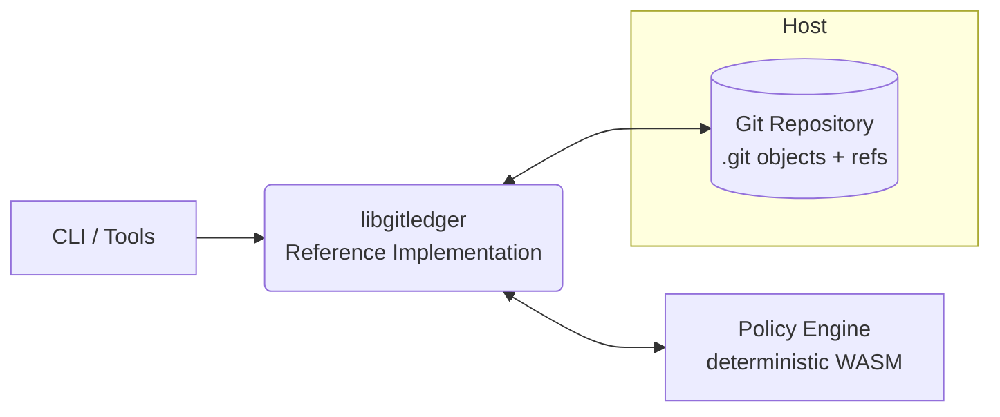

# Ledger-Kernel Specification — Overview

Ledger-Kernel defines a minimal, deterministic protocol for verifiable, append-only ledgers built directly on Git.  
It introduces conventions and invariants over standard Git objects and refs to guarantee fast-forward-only evolution, authenticated entries, and reproducible state replay—without inventing new storage or services.

## Design Goals

- **Determinism**  
  Replay of the same ordered set of entries MUST yield the same final state.  
  Implementations MUST avoid sources of nondeterminism (wall-clock time, randomness, ambient I/O) in the kernel path.

- **Immutability**  
  Ledger history MUST evolve via fast-forward only.  
  Rewrites (rebase, force-push) are forbidden on ledger refs.

- **Auditability**  
  Each entry MUST be content-addressed and author-authenticated.  
  Verification MUST be possible offline from repository data alone.

- **Portability**  
  The protocol is Git-native: no new object types, daemons, or sidecar databases.  
  Any compliant implementation can interoperate over a normal `.git` repository.

## Git-Native by Construction

Ledger-Kernel does not introduce new object formats.  
Instead, it constrains how you use the ones Git already has:

- **Commits as Entries**  
  A *ledger entry* is a conventional Git commit recorded under a dedicated namespace (e.g., `refs/_ledger/<namespace>`).  
  Entry payloads and metadata live in commit trees and trailers per the wire format.

- **Namespaced Refs**  
  Each ledger ref represents a single totally ordered sequence of entries.  
  Ref updates MUST be fast-forward only.

- **Policy & Attestation**  
  Entries are admitted only if they satisfy configured policies (e.g., WASM-based checks) and carry required attestations.  
  Proofs are stored alongside entry data in the repository.

- **Verification & Replay**  
  Verification and deterministic replay operate entirely on repository contents; no external state is consulted.

## How the Pieces Fit

- The Specification (this section and its subpages) defines the model, invariants, and normative rules.
- libgitledger provides a portable C implementation of those rules.
- The CLI and integrations sit on top, calling into libgitledger and using the host’s Git.

## Where to Next

- [Model](/spec/model) — formal state-transition model: a ledger is a totally ordered sequence of entries; Sₙ = T(Sₙ₋₁, entryₙ).
- [Formal Spec](/spec/formal-spec) — normative clauses for data structures, operations, and constraints (RFC-style, numbered).
- [Wire Format](/spec/wire-format) — JSON schemas, attestation encodings, and canonical serialization rules.
- [Determinism & Replay](/spec/determinism) — eliminating nondeterminism and proving reproducibility.
- [Compliance](/spec/compliance) — suite layout, conformance levels, and reporting procedure.
